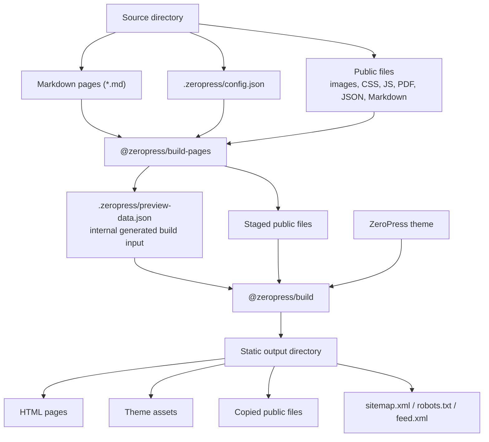

# @zeropress/build-pages

Build ZeroPress static output for modern hosting platforms.

`@zeropress/build-pages` turns a directory of Markdown files and public assets into a static ZeroPress site. It discovers Markdown pages, prepares the site data, stages public files, and runs `@zeropress/build`.

The generated output is plain static files that can be deployed to GitHub Pages, Cloudflare Pages, Netlify, Vercel, or any static hosting provider.

## Build Flow

```txt
source directory
  Markdown pages + .zeropress/config.json + public files
        |
        v
@zeropress/build-pages
  generates .zeropress/preview-data.json
  stages public files
        |
        v
@zeropress/build + ZeroPress theme
        |
        v
static output directory
  HTML pages + assets + copied public files
```



## Usage

### GitHub Action

A basic Pages deployment workflow with the `zeropress-build-pages` action looks like this.

```yaml
name: Build and Deploy Docs to GitHub Pages
on:
  push:
    branches: ["main"]
  workflow_dispatch:
permissions:
  contents: read
  pages: write
  id-token: write
concurrency:
  group: "pages"
  cancel-in-progress: false
jobs:
  build:
    runs-on: ubuntu-latest
    steps:
      - name: Checkout
        uses: actions/checkout@v6
      - name: Setup Pages
        uses: actions/configure-pages@v6
      - name: Build ZeroPress Pages
        uses: zeropress-app/zeropress-build-pages@v0
        with:
          source: ./documents
          destination: ./_site
      - name: Upload artifact
        uses: actions/upload-pages-artifact@v5
  deploy:
    runs-on: ubuntu-latest
    needs: build
    environment:
      name: github-pages
      url: ${{ steps.deployment.outputs.page_url }}
    steps:
      - name: Deploy to GitHub Pages
        id: deployment
        uses: actions/deploy-pages@v5
```

The action `zeropress-build-pages` builds the static files only. Uploading and deploying are handled by your hosting provider's deployment action or CLI.

In the action inputs:

- `source` is the directory that contains your Markdown pages, public files, and optional `.zeropress/config.json`. The default is `./docs`.
- `destination` is the directory where the generated static site is written. The default is `./_site`.

For GitHub Pages, the generated `destination` directory can be passed to `actions/upload-pages-artifact`. For Cloudflare Pages, Netlify, Vercel, or another static host, pass the same `destination` directory to that provider's deploy step.

### npx

Use `npx` when you want to run Build Pages without adding it to your project dependencies.

```bash
npx @zeropress/build-pages --source ./documents --destination ./_site
```

### package.json script

Use a package script when your project already has a Node.js toolchain.

```bash
npm install --save-dev @zeropress/build-pages
```

```json
{
  "scripts": {
    "build": "zeropress-build-pages --source ./documents --destination ./_site"
  }
}
```

```bash
npm run build
```

## CLI Options

The CLI requires explicit input and output paths. The GitHub Action keeps safe defaults for workflow convenience.

| Option | Default | Purpose |
| --- | --- | --- |
| `--source <dir>` | required | Dedicated source directory containing Markdown and public files |
| `--destination <dir>` | required | Output directory |
| `--theme docs` | `docs` | Bundled docs theme |
| `--theme-path <dir>` | none | Custom ZeroPress theme directory |
| `--config <path>` | `<source>/.zeropress/config.json` | Build Pages config |
| `--site-url <url>` | config `site.url` | Canonical URL override |
| `--skip-untitled-markdown` | `false` | Skip Markdown without a page title |
| `--skip-link-check` | `false` | Skip link checking |

## Source Tree

The source directory is both the Markdown source root and the public passthrough root. GitHub Action usage defaults to `./docs`; CLI usage requires `--source`.

Use a dedicated content directory such as `docs/` or `documents/`. Repository root source (`--source ./`) is not supported, because Build Pages uses `.zeropress/` in the current working directory for internal working files.

```txt
docs/
  index.md
  guide.md
  assets/
  .zeropress/
    config.json
```

Build Pages stages the source tree before calling `@zeropress/build`. Generated ZeroPress output wins over staged public files.

The source directory must not overlap the destination directory, the selected theme directory, or the internal `.zeropress/` working directory.

Ignored while staging and Markdown discovery:

- hidden paths such as `.git`, `.env`, and `.zeropress`
- `node_modules`
- `Thumbs.db`
- `*.key`
- `*.pem`
- symlinks

Additional Markdown discovery ignores:

- path segments starting with `_`
- path segments starting with `#`
- path segments ending with `~`
- `vendor`

## Markdown Pages

- `*.md` files are discovered recursively.
- Each Markdown page needs a page title. Build Pages uses front matter `title`, then an ATX H1 (`# Title`), then a Setext H1 (`Title` + `====`).
- If no title can be found, the build fails unless `--skip-untitled-markdown` is used.
- `--skip-untitled-markdown` skips those Markdown files. It does not create untitled pages.
- Root `index.md` becomes the front page when no config is present.
- Nested `index.md` maps to a directory route, such as `cli/index.md` -> `/cli/`.
- Other Markdown files map to extensionless routes, such as `cli/tool.md` -> `/cli/tool`.
- Markdown links to other discovered `.md` files are rewritten to generated public URLs.
- Original Markdown files remain available as public passthrough files.

Optional YAML front matter is supported at the top of Markdown files:

```md
---
title: Install ZeroPress
description: Build a static docs site from Markdown.
path: guides/install
status: published
meta:
  source: docs
---

Body content...
```

All supported front matter fields are optional. When `status` is omitted, the page is treated as `published`.

Supported front matter fields:

| Field | Purpose |
| --- | --- |
| `title` | Page title. Takes priority over Markdown H1. |
| `description` | Page excerpt and description. |
| `path` | Generated route path, such as `guides/install` for `/guides/install`. |
| `status` | `published` includes the page. `draft` skips the page. Other values warn and skip. |
| `meta` | Optional scalar/null metadata copied to the generated page. |

Unknown front matter fields are ignored to make migration from existing Markdown sites easier.

## Config

Build Pages reads `<source>/.zeropress/config.json` when present. Missing config falls back to defaults.

```json
{
  "$schema": "https://zeropress.dev/schemas/zeropress-build-pages.config.v0.1.schema.json",
  "version": "0.1",
  "site": {
    "title": "My Docs",
    "description": "Project documentation",
    "url": "https://example.github.io/project",
    "footer": {
      "copyright_text": "Copyright 2026 Example Corp.",
      "attribution": {
        "enabled": true
      }
    }
  },
  "front_page": {
    "type": "markdown"
  },
  "menus": {
    "primary": {
      "name": "Primary Menu",
      "items": [
        { "title": "Home", "url": "/" },
        { "title": "Guide", "url": "/guide" }
      ]
    }
  },
  "custom_html": {
    "head_end": { "file": ".zeropress/head-end.html" },
    "body_end": { "file": ".zeropress/body-end.html" }
  }
}
```

`front_page` modes:

- `{ "type": "theme_index" }`: render bundled theme home.
- `{ "type": "markdown" }`: render `index.md` through `page.html`.
- `{ "type": "html" }`: render `.zeropress/index.html` through `page.html`.
- `{ "type": "html", "layout": false }`: write trusted standalone HTML directly.

HTML front page and `custom_html` files must stay inside `.zeropress/`.

`site.footer.copyright_text` is rendered by the bundled docs theme when present. If it is omitted, the bundled docs theme falls back to `site.title`. ZeroPress does not add a copyright symbol automatically.

The bundled docs theme shows `Published with ZeroPress.` by default. Set `site.footer.attribution.enabled` to `false` to hide it.

Schemas:

- `schemas/zeropress-build-pages.config.v0.1.schema.json`
- `schemas/zeropress-build-pages.config.schema.json`

## Internal `.zeropress/` Files

Build Pages writes internal working files to `.zeropress/` in the current working directory. These files are not the final deploy output. The final static site is written to the `destination` directory.

```txt
.zeropress/
  build-pages-config.json
  preview-data.json
  build-report.json
  public-assets/
```

`build-pages-config.json` is the resolved user-facing Build Pages config used for the current run. It combines source config, defaults, and CLI or Action input overrides where applicable.

`preview-data.json` is an internal generated build input for the ZeroPress renderer. Most users do not need to edit or understand this file.

`build-report.json` records discovered Markdown counts, skipped Markdown files, front page resolution, and custom HTML slots.

`public-assets/` is a temporary staged public root used before the final ZeroPress render.

## Destination Output

The `destination` directory contains the deployable static site. It includes generated ZeroPress HTML, copied public files, and original Markdown files unless they are excluded by the public passthrough rules.

## Development

```bash
npm install
npm run build:action
npm test
```
