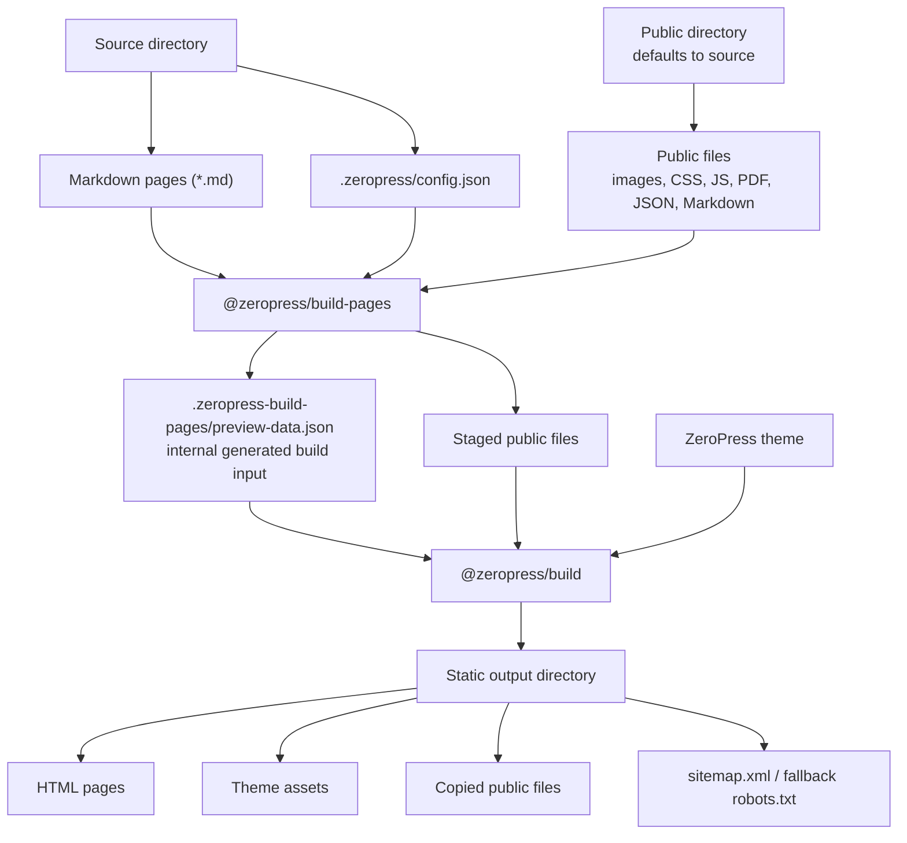

# @zeropress/build-pages


Build ZeroPress static output for modern hosting platforms.

`@zeropress/build-pages` turns Markdown files and public assets into a static ZeroPress site. It discovers Markdown pages, prepares the site data, stages public files, and runs [`@zeropress/build`](https://github.com/zeropress-app/zeropress-build).

The generated output is plain static files that can be deployed to GitHub Pages, Cloudflare Pages, Netlify, Vercel, or another static hosting provider at the origin root. Subdirectory mount paths are not supported.

Build Pages is the Markdown-source document publishing entry point for ZeroPress.
Other ZeroPress workflows can build directly from `preview-data.json` and a
theme, or publish from ZeroPress Studio after managed authoring, media upload,
WXR import, and build trigger workflows.

## Build Flow

```txt
source directory
  Markdown pages + .zeropress/config.json
public directory
  public files (defaults to source)
        |
        v
@zeropress/build-pages
  generates .zeropress-build-pages/preview-data.json
  stages public files
        |
        v
@zeropress/build + ZeroPress theme
        |
        v
static output directory
  HTML pages + assets + copied public files
```



## Usage

### GitHub Action

A basic Pages deployment workflow with the `zeropress-build-pages` action looks like this. The Pages site must be served at the origin root, such as a user or organization Pages site or a site with a custom domain. GitHub Project Pages served from `https://<owner>.github.io/<repository>/` are not supported.

```yaml
name: Build and Deploy Docs to GitHub Pages
on:
  push:
    branches: ["main"]
  workflow_dispatch:
permissions:
  contents: read
  pages: write
  id-token: write
concurrency:
  group: "pages"
  cancel-in-progress: false
jobs:
  build:
    runs-on: ubuntu-latest
    steps:
      - name: Checkout
        uses: actions/checkout@v6
      - name: Setup Pages
        uses: actions/configure-pages@v6
      - name: Build ZeroPress Pages
        uses: zeropress-app/zeropress-build-pages@v1
        with:
          source: ./docs
          destination: ./_site
      - name: Upload artifact
        uses: actions/upload-pages-artifact@v5
  deploy:
    runs-on: ubuntu-latest
    needs: build
    environment:
      name: github-pages
      url: ${{ steps.deployment.outputs.page_url }}
    steps:
      - name: Deploy to GitHub Pages
        id: deployment
        uses: actions/deploy-pages@v5
```

The action `zeropress-build-pages` builds the static files only. Uploading and deploying are handled by your hosting provider's deployment action or CLI.

`@v1` is the moving compatibility tag for the latest Build Pages 1.x release. Pin `@v1.0.0` for the exact initial release or use a full commit SHA when an immutable workflow dependency is required.

Minimal action usage:

```yaml
- name: Build ZeroPress Pages
  uses: zeropress-app/zeropress-build-pages@v1
```

That is equivalent to:

```yaml
- name: Build ZeroPress Pages
  uses: zeropress-app/zeropress-build-pages@v1
  with:
    source: ./docs
    destination: ./_site
    theme: docs
    skip-untitled-markdown: false
    skip-link-check: false
    copy-markdown-source: true
```

Custom input example:

```yaml
- name: Build ZeroPress Pages
  uses: zeropress-app/zeropress-build-pages@v1
  with:
    source: ./docs
    public-dir: ./public
    destination: ./_site
    theme-path: ./theme-docs
    config: ./docs/.zeropress/config.json
    site-url: https://example.com
    copy-markdown-source: false
```

Separate public asset directory example:

```yaml
- name: Build ZeroPress Pages
  uses: zeropress-app/zeropress-build-pages@v1
  with:
    source: ./docs
    public-dir: ./public
    destination: ./_site
```

In the action inputs:

- `source` is the directory that contains your Markdown pages and optional `.zeropress/config.json`. The default is `./docs`.
- `public-dir` is the directory copied as public passthrough files. The default is `source`. If you set it explicitly, the directory must exist.
- `destination` is the directory where the generated static site is written. The default is `./_site`.
- `theme` is the bundled theme name. The default is `docs`, which aliases `docs1`. Available bundled names are `docs`, `docs1`, `docs2`, and `plain`.
- `theme-path` is a custom local ZeroPress theme directory. It takes precedence over `theme`.
- `config` is the config file path. The default is `<source>/.zeropress/config.json`.
- `site-url` overrides the canonical site URL from config. It must be a credential-free absolute HTTP(S) origin-root URL such as `https://example.com`, without a path, query, or fragment. Omit it when the deployment URL is not known.
- `skip-untitled-markdown` skips Markdown files without a page title instead of failing. The default is `false`.
- `skip-link-check` skips internal link checking after build. The default is `false`; broken internal links are reported as warnings and do not fail the build.
- `copy-markdown-source` copies original Markdown files to the generated output and enables bundled theme source links such as `View as Markdown`. The default is `true`; when set to `false`, public `.md` passthrough files are also skipped.

Boolean Action inputs accept only the exact values `true` and `false`. Other strings fail the build instead of falling back to a default.

For a supported origin-root GitHub Pages site, the generated `destination` directory can be passed to `actions/upload-pages-artifact`. For Cloudflare Pages, Netlify, Vercel, or another static host, pass the same `destination` directory to that provider's deploy step and configure the deployment at the origin root.

Build Pages intentionally uses root-relative page, asset, search, and public-file URLs. It does not support a base path or mount path. Deployments such as `https://example.com/docs/` or GitHub Project Pages at `https://<owner>.github.io/<repository>/` require a custom domain or another origin-root hosting arrangement.

Need a custom theme? Start with [`@zeropress/create-theme`](https://www.npmjs.com/package/@zeropress/create-theme), then point `theme-path` to the generated `theme/` directory:

```bash
npx @zeropress/create-theme --name my-docs-theme --template docs
```

```yaml
with:
  source: ./docs
  public-dir: ./public
  destination: ./_site
  theme-path: ./my-docs-theme/theme
```

### Vercel

Use the `Other` framework preset and set the generated output directory as Vercel's Output Directory.

Project settings:

| Setting | Value |
| --- | --- |
| Framework Preset | `Other` |
| Build Command | `npx --yes @zeropress/build-pages@1 --source ./docs --destination ./_site` |
| Output Directory | `_site` |

If your public assets live outside the source directory, include `--public-dir`:

```bash
npx --yes @zeropress/build-pages@1 --source ./docs --public-dir ./public --destination ./_site
```

CI and hosting examples use `@1` to receive compatible Build Pages 1.x updates without automatically crossing a future major-version boundary.

If your project uses a `package.json` script, set the Vercel Build Command to `npm run build` and keep the Output Directory as `_site`.

Vercel users should normally add `vercel.json` with `{ "cleanUrls": true }` so extensionless links resolve like the major static hosts. If you prefer explicit HTML links without provider clean URL behavior, set Build Pages config `markdown.link_output` to `html`.

### npx

Use `npx` when you want to run Build Pages without adding it to your project dependencies.

```bash
npx @zeropress/build-pages --source ./docs --destination ./_site
```

### package.json script

Use a package script when your project already has a Node.js toolchain.

```bash
npm install --save-dev @zeropress/build-pages
```

```json
{
  "scripts": {
    "build": "zeropress-build-pages --source ./docs --destination ./_site"
  }
}
```

```bash
npm run build
```

## CLI Options

The CLI requires explicit input and output paths. The GitHub Action keeps safe defaults for workflow convenience.

| Option | Default | Purpose |
| --- | --- | --- |
| `--source <dir>` | required | Dedicated source directory containing Markdown and optional config |
| `--public-dir <dir>` | source | Public passthrough directory. Explicit paths must exist. |
| `--destination <dir>` | required | Output directory |
| `--theme <name>` | `docs` | Bundled theme name. `docs` aliases `docs1`; available names are `docs`, `docs1`, `docs2`, and `plain`. |
| `--theme-path <dir>` | none | Custom ZeroPress theme directory |
| `--config <path>` | `<source>/.zeropress/config.json` | Build Pages config |
| `--site-url <url>` | config `site.url` | Origin-root canonical URL override; subdirectory URLs are rejected |
| `--skip-untitled-markdown` | `false` | Skip Markdown without a page title |
| `--skip-link-check` | `false` | Skip warning-only internal link checking |
| `--no-copy-markdown-source` | `false` | Do not copy source Markdown or public `.md` files to output |

Only the documented CLI options and GitHub Action inputs configure a public Build Pages run. Internal `ZEROPRESS_BUILD_PAGES_CONFIG` and `ZEROPRESS_SITE_URL` environment variables used between the runner and its bundled prebuild process are not ambient override interfaces; inherited values are ignored unless the corresponding CLI option or Action input is provided.

Human-readable diagnostics escape terminal control and directional characters as visible `\uXXXX` sequences. Generated Preview Data, reports, Markdown, and HTML content are not rewritten by this terminal-only formatting.

## Source Tree

The source directory is the folder that Build Pages reads for Markdown pages and optional `.zeropress/config.json`. By default, the source directory is also the public passthrough root. Use `public-dir` when you want to keep Markdown source and public assets separate.

Use a dedicated content directory such as `docs/` or `documents/`. Repository root source (`--source ./`) is not supported.

```txt
my-site/
  docs/                 # source
    index.md
    guide.md
    .zeropress/
      config.json
  public/               # public-dir, optional
    assets/
      logo.png
    favicon.svg
    robots.txt
  _site/                # destination, generated
```

Build Pages stages the public directory before calling [`@zeropress/build`](https://github.com/zeropress-app/zeropress-build). Build reserves those final public paths during output planning and rejects collisions with generated routes, assets, search artifacts, and special files before writing.

The complete destination is built in a sibling staging directory. A successful
build replaces the previous destination, while a prebuild, validation, render,
or public-file failure leaves the previous deployable output untouched.

Root-level public files named `favicon.ico`, `favicon.svg`, `favicon.png`, and `apple-touch-icon.png` are copied to the destination and auto-injected into generated HTML `<head>` output.

A root-level public `sitemap.xsl` is copied to the destination. When ZeroPress generates `sitemap.xml`, it auto-discovers that file and adds an XML stylesheet processing instruction for `/sitemap.xsl`.

The source directory must be an existing dedicated directory, must not be a symlink, and must not overlap the destination directory, the selected theme directory, or the internal `.zeropress-build-pages/` working directory. The destination and selected theme directories must not overlap. An explicit public directory must be an existing dedicated directory and must not be a file, symlink, repository root, destination directory, selected theme directory, or internal `.zeropress-build-pages/` working directory.

If `public-dir` is inside `source`, Build Pages excludes that public subtree from Markdown page discovery.

Ignored while copying public passthrough files and discovering Markdown pages:

- hidden paths such as `.git`, `.env`, and `.zeropress`
- `node_modules`
- `Thumbs.db`
- `*.key`
- `*.pem`
- symlinks

Additional Markdown discovery ignores:

- path segments starting with `_`
- path segments starting with `#`
- path segments ending with `~`
- `vendor`

## Markdown Pages

- `*.md` files are discovered recursively.
- Each Markdown page needs a page title. Build Pages uses front matter `title`, then an ATX H1 (`# Title`), then a Setext H1 (`Title` + `====`).
- If no title can be found, the build fails unless `--skip-untitled-markdown` is used.
- `--skip-untitled-markdown` skips those Markdown files. It does not create untitled pages.
- Root `index.md` becomes the front page when no config is present.
- Nested `index.md` maps to a directory route, such as `cli/index.md` -> `/cli/`.
- Other Markdown files map to extensionless routes, such as `cli/tool.md` -> `/cli/tool`.
- Source-relative Markdown links to other discovered `.md` files are rewritten to generated public URLs.
- Config `markdown.link_output` controls whether rewritten links use clean URLs or explicit `.html` URLs.
- Source-relative links to existing files under `public-dir` are rewritten to output-root public URLs.
- Original Markdown files remain available as public passthrough files by default.
- Use `--no-copy-markdown-source` or Action input `copy-markdown-source: false` to keep source Markdown and public `.md` passthrough files out of the generated output. This also hides bundled theme source links such as `View as Markdown`.

Optional YAML front matter is supported at the top of Markdown files:

```md
---
title: Install ZeroPress
description: Build a static docs site from Markdown.
path: guides/install
status: published
discoverability: default
updated_at: none
featured_image: /images/share.png
meta:
  source: docs
data:
  stack:
    - ZeroPress
    - Cloudflare
  facts:
    - label: Role
      value: Documentation
---

Body content...
```

Build Pages supports plain YAML front matter delimited by `---`. JavaScript front matter, language-specific front matter delimiters, YAML custom tags, anchors, aliases, and block scalars are not supported.

All supported front matter fields are optional. When `status` is omitted, the page is treated as `published`.

Supported front matter fields:

| Field | Purpose |
| --- | --- |
| `title` | Page title. Takes priority over Markdown H1. |
| `description` | Explicit authored Page excerpt. When omitted or empty, Build Pages stores `excerpt: ""`; Build Core derives runtime summaries and metadata from rendered content. |
| `path` | Generated route path, such as `guides/install` for `/guides/install`. |
| `status` | `published` includes the page. `draft` skips the page. Other values warn and skip. |
| `discoverability` | `default`, `noindex`, or `delist`. Missing is `default`. |
| `updated_at` | `none`, `git`, or an ISO datetime string. Overrides config `markdown.updated_at` for this page. Invalid strings warn and are ignored for that page. |
| `featured_image` | Optional share image for generated Open Graph metadata. |
| `meta` | Optional scalar/null metadata copied to the generated page. |
| `data` | Optional structured JSON-style data for theme-facing lists, facts, galleries, timelines, or swatches. |

Unknown front matter fields are ignored to make migration from existing Markdown sites easier.

Build Pages never extracts a Preview Data excerpt from Markdown body text. An omitted `description` and an explicit `description: ""` both produce `excerpt: ""`; a non-empty `description` is the only authored Page excerpt. Build Core independently derives the Theme Runtime `page.summary` and metadata description from rendered content when the authored excerpt is empty.

Each explicit `path` segment follows the shared ZeroPress slug policy: Unicode letters, combining marks, decimal digits, periods, hyphens, and underscores are supported, at least one letter or digit is required, and each NFC-normalized segment is limited to 200 Unicode code points. A period may appear only as an isolated internal character, so values such as `v0.6` are valid while `.hidden`, `version.`, and `a..b` are rejected. Characters such as `!`, whitespace, percent escapes, path separators, and control characters are also rejected. Filename-derived routes preserve isolated internal periods, collapse period runs with other unsupported filename characters into hyphens, and remove leading or trailing periods.

No page-path segment may end with the literal lowercase suffix `.html`; the configured permalink output style owns generated filenames. This matches the Preview Data page-path contract for both a final `.html` suffix and `.html/` inside a path. The check is case-sensitive, so an explicit segment ending in `.HTML` remains valid.

Generated preview-data omits `page.path` when the explicit route and the effective `site.permalinks.pages` fallback for `page.slug` produce both the same public URL and the same output file. Top-level routes normally use this compact form. Nested or custom routes remain explicit whenever their effective destination differs, and terminal `index` paths are preserved whenever removing `path` would change clean-URL or `html-extension` behavior.

`page.slug` is the leaf route slug (a terminal `index` route uses its parent segment), while `page.path` is the effective route identity. Pages under different paths may therefore share a slug. Build Pages detects collisions by NFC-normalized effective path, and front-page and collection references always use that path.

Route URLs and generated output paths must not collide with public passthrough files. Clean-host aliases participate in the check: `page.html` owns `/page`, while `page/index.html` owns `/page/`. For example, a page route `/favicon.ico` conflicts with public `favicon.ico`, and `/guide` conflicts with either public `guide.html` or `guide/index.html`. Rename the route or public file instead of relying on host-specific precedence.

`featured_image` accepts an absolute `https://` or `http://` URL, a root-relative public URL such as `/images/share.png`, or a source-relative path to an existing file inside `public-dir`. Root-relative and source-relative values are converted to an absolute URL with `site.url`. If Build Pages cannot safely resolve the value, it prints a warning and omits `featured_image` for that page.

`status` controls route generation. `status: draft` removes the Markdown file from generated preview-data and no HTML route is created.

`discoverability` controls automatic exposure after a route is generated:

- `default`: no special handling.
- `noindex`: generate the page and add HTML robots `noindex`.
- `delist`: generate the page, add HTML robots `noindex`, and exclude it from automatic discovery outputs such as sitemap, native search, and generated post/page listing data.

`delist` is not a security or permission feature. Direct links, explicit menus, explicit collections, and body links can still expose the page.

`updated_at` controls optional page update metadata. If config uses `markdown.updated_at: "git"`, set `updated_at: none` on landing, index, or promotional pages that should not show an update date. If config uses `none`, set `updated_at: git` on a specific information page to opt in. A valid ISO datetime string is copied directly to generated preview-data as `page.updated_at_iso`.

Use `meta` for small scalar flags and metadata. Use `data` when a theme should iterate structured content:

```html
{{#for fact in page.data.facts}}
  <dt>{{fact.label}}</dt>
  <dd>{{fact.value}}</dd>
{{/for}}
```

## Markdown Rendering

Build Pages renders Markdown through ZeroPress build-core before writing HTML.
This includes common Markdown extensions such as tables, strikethrough, task
lists, GitHub-style alerts, heading IDs, and fenced code blocks.

Fenced code blocks are highlighted at build time with `highlight.js`.

````md
```js
console.log("hello");
```
````

When a fenced code block has a language info string and `highlight.js`
recognizes it, ZeroPress uses that language. If the language is missing or not
recognized, ZeroPress falls back to automatic detection. The generated markup
keeps the `language-*` class and adds `hljs-*` token classes for highlighted
spans:

```html
<pre><code class="language-js">...</code></pre>
```

Themes only need CSS for the generated code markup. A client-side
`highlight.js` script is not required for Markdown rendered during the build.

ZeroPress build-core currently uses `highlight.js@11.11.1` and the built-in
languages returned by `hljs.listLanguages()`. In this release, that is 192
canonical language names, plus recognized aliases such as `js`, `ts`, `jsx`,
`sh`, and `zsh`. A language listed in the Highlight.js documentation with a
third-party package is not bundled by ZeroPress unless it is also present in
`hljs.listLanguages()`.

See the upstream
[`highlight.js@11.11.1` supported languages table](https://github.com/highlightjs/highlight.js/blob/11.11.1/SUPPORTED_LANGUAGES.md)
for language names, aliases, and third-party package notes. Common built-in
examples include `bash`, `shell`, `js`, `javascript`, `ts`, `typescript`,
`json`, `yaml`, `html`, `xml`, `css`, `scss`, `python`, `ruby`, `php`, `java`,
`go`, `rust`, `c`, `cpp`, `csharp`, `sql`, `graphql`, `dockerfile`, `nginx`,
`markdown`, and `diff`.

Mermaid is intentionally different: `mermaid` fences remain readable code
blocks such as `pre code.language-mermaid`. Diagram rendering is optional
progressive enhancement owned by the theme or site.

## Config

Build Pages reads `<source>/.zeropress/config.json` when present. A missing implicit default config falls back to defaults. A config path supplied explicitly through `--config` or the Action `config` input must exist.

Config objects are closed contracts: unknown root or nested fields are rejected. Optional `$schema` must be a string, and every authored config file must declare `version: "1.0"`. Earlier config versions are not accepted. When the default config file does not exist, Build Pages still uses its built-in defaults. Defaults apply only when a field is omitted; an explicitly provided value with the wrong type, an invalid enum value, or a blank value for a non-blank field is an error.

Generated `.zeropress-build-pages/build-pages-config.json` always uses the canonical v1.0 schema URL and `"version": "1.0"`.

Build Pages 1.x and Build Pages Config 1.0 are the user-facing tool contracts. The generated build input remains Preview Data 0.7 and bundled themes remain Theme Runtime 0.7; those contracts are versioned independently.

`site.url` is optional. Omit it or use an empty string while the deployment URL is unknown. When present, it must be a credential-free absolute HTTP(S) origin-root URL such as `https://example.com`, without a path, query, or fragment. Build Pages canonicalizes it to `URL.origin` and does not support sites mounted below an origin path. Runtime WHATWG URL parsing additionally validates hostname, port range, and IP-address syntax.

See the public config reference at [build-pages.zeropress.dev/reference/config/](https://build-pages.zeropress.dev/reference/config/).

```json
{
  "$schema": "https://schemas.zeropress.dev/build-pages-config/v1.0/schema.json",
  "version": "1.0",
  "site": {
    "title": "My Docs",
    "description": "Project documentation",
    "url": "https://example.com",
    "logo": {
      "src": "/logo.svg",
      "alt": "My Docs"
    },
    "locale": "en-US",
    "expose_generator": true,
    "search": true,
    "robots": { "allow_indexing": true },
    "footer": {
      "copyright_text": "Copyright 2026 Example Corp.",
      "attribution": true
    },
    "meta": {
      "issue": "Spring 2026",
      "show_sponsor_banner": false
    }
  },
  "markdown": {
    "updated_at": "git",
    "link_output": "clean"
  },
  "front_page": {
    "type": "markdown"
  },
  "menus": {
    "primary": {
      "name": "Primary Menu",
      "items": [
        { "title": "Home", "url": "/" },
        {
          "title": "Guide",
          "url": "/guide",
          "meta": {
            "icon": "book-open",
            "badge": "New"
          }
        }
      ]
    }
  },
  "collections": {
    "guides": {
      "title": "Guides",
      "items": [
        "getting-started/index.md",
        "deployment/index.md"
      ]
    }
  },
  "custom_html": {
    "head_end": { "file": ".zeropress/head-end.html" },
    "body_end": { "file": ".zeropress/body-end.html" }
  }
}
```

`front_page` modes:

- `{ "type": "theme_index" }`: render bundled theme home.
- `{ "type": "markdown" }`: render `index.md` through `page.html`.
- `{ "type": "html" }`: render `.zeropress/index.html` through `page.html`.
- `{ "type": "html", "layout": false }`: write trusted standalone HTML directly.

HTML front page and `custom_html` files, including the final targets of symlinks, must resolve inside the source `.zeropress/` directory.

A layout-enabled HTML front page also produces `excerpt: ""`; its HTML body and `site.description` are not promoted into authored Preview Data. Build Core may derive the runtime summary from the rendered body and uses `site.description` only as the final metadata fallback when that front page has no visible summary.

The authoring config keeps each custom HTML slot as a `{ "file": "..." }` reference. Build Pages reads the selected file as UTF-8, requires non-whitespace content, limits each slot to 65,536 Unicode code points, and preserves the raw whitespace. Generated Preview Data uses flat trusted strings such as `{ "custom_html": { "head_end": "<meta ...>" } }`; the generated resolved Build Pages config continues to record the original `{ file }` reference.

Configured source file paths are exact source-root relative paths. Build Pages does not trim surrounding whitespace, convert backslashes to slashes, or change extension case. Use `/` separators and lowercase `.md` or `.html` extensions as shown above.

Menu item `meta` is optional scalar display metadata copied into generated preview-data for themes that manually iterate menus. Use it for small values such as `icon`, `badge`, or `accent`; arrays and objects are not accepted.

When `menus` is omitted, Build Pages materializes the built-in `primary` menu with a Home item. An explicit `"menus": {}` opts out and materializes no menus. If a menu omits `name`, its menu id becomes the resolved name. `collections` omission and `{}` both materialize no collections; an omitted collection `title` materializes its collection id. These fallbacks are written explicitly to the resolved config and generated Preview Data.

Menu URLs may be credential-free absolute HTTP(S) URLs or single-slash root-relative paths. Query strings and fragments are preserved. Bare, dot-relative, protocol-relative, dot-segment, non-Web scheme, query-only or fragment-only values, raw whitespace or backslashes, control characters, and malformed percent escapes are rejected. Runtime WHATWG URL parsing additionally validates absolute-URL hostname, port range, and IP-address syntax.

`collections` defines group-level reading order from Markdown source paths. Build Pages converts each source-relative `.md` path into preview-data collection items such as `{ "type": "page", "path": "guides/deployment" }`. The path is the Page's effective route path, so equal leaf slugs under different paths remain unambiguous. Collection prev/next cursors stop at collection boundaries, so the last item in `collections.guides` does not continue into another collection.

`markdown.updated_at` is optional and accepts `none` or `git`. Missing or `none` keeps current behavior and generates no update date. `git` reads each Markdown file's latest commit date from the nearest Git worktree containing that file and adds `page.updated_at_iso` to generated preview-data. This remains correct when the CLI is invoked outside the source repository. For accurate history in GitHub Actions, configure checkout with `fetch-depth: 0`.

`markdown.link_output` is optional and accepts `clean` or `html`. Missing or `clean` keeps the default clean URL rewrite, such as `../guide/index.md` -> `/guide/` and `../spec/foo.md` -> `/spec/foo`. Use `html` when a host requires explicit HTML links, such as `../guide/index.md` -> `/guide/index.html` and `../spec/foo.md` -> `/spec/foo.html`. Query strings, hash fragments, and optional Markdown link titles are preserved. This setting only controls source-relative `.md` page links; external URLs, root-relative URLs, anchors, non-Markdown links, escaped link syntax, inline code, and fenced or indented code blocks are not changed by `markdown.link_output`.

Source-relative links to existing files under `public-dir` are rewritten independently to output-root URLs. This keeps links usable in GitHub repository browsing and editors while still producing clean deployed asset URLs:

```md

```

If `public-dir` is `./public` and `public/logo.svg` exists, Build Pages rewrites that image URL to `/logo.svg`. Query strings and hash fragments are preserved, such as `../public/icons.svg#mark` -> `/icons.svg#mark`. Missing files and files outside `public-dir` are left unchanged.

Markdown raw HTML may use safe native media elements such as `video`, `audio`, `source`, and `track`. Use source-relative public asset paths for site-owned media files.

Raw HTML links may use `target="_blank"`. Build Pages preserves `_blank`, removes other `target` values, and adds missing `noopener` / `noreferrer` tokens to `_blank` links. Safe `rel` tokens such as `nofollow`, `ugc`, `sponsored`, and `external` are preserved.

Themes can render the generated value with normal escaped interpolation:

```html
{{#if page.updated_at_iso}}
  <time datetime="{{page.updated_at_iso}}" data-zp-local-date>{{page.updated_at}}</time>
{{/if}}
```

Client-side progressive enhancement may replace the fallback text with a localized date. The fallback remains useful when JavaScript is unavailable.

`site.footer.copyright_text` is rendered by bundled documentation themes when present. If it is omitted, they fall back to `site.title`. ZeroPress does not add a copyright symbol automatically.

Bundled documentation themes show `Published with ZeroPress` by default. Set `site.footer.attribution` to `false` to hide it.

`site.logo` is optional theme-facing brand data. Use a root-relative public path such as `/logo.svg` for public logo files, or an absolute `https://` or `http://` URL for media-hosted logos. Document-relative paths such as `./logo.svg` and `../logo.svg` are rejected because browsers resolve them relative to each generated page. Runtime WHATWG URL parsing validates absolute-URL hostname, port range, and IP-address syntax. Build Pages emits `media_origin: ""`, so root-relative logo paths remain same-host public paths.

`site.locale` is optional language metadata copied into generated preview-data. Valid non-canonical BCP 47 input is canonicalized before it is written. It affects theme-facing `site.locale`, the common `language` render context value, generated HTML language metadata, and feed language. Missing `site.locale` defaults to `en-US`.

`site.meta` is an optional scalar extension map copied into generated preview-data. Use it for site-level theme conventions such as labels, feature flags, or issue names. Values must be strings, finite numbers, booleans, or null. Use first-class fields such as `site.logo.src` instead of ad hoc keys like `site.meta.logo_url`.

`site.expose_generator` controls the HTML generator meta tag. Missing or `true` emits `<meta name="generator" content="ZeroPress">`; set it to `false` for white-label sites.

`site.robots.allow_indexing` controls only the generated fallback `robots.txt`. Missing `site.robots` or `true` allows indexing; `false` writes `User-agent: *` / `Disallow: /`. If the public directory contains `robots.txt`, that file is copied as-is and takes priority over this setting. ZeroPress does not append a `Sitemap` directive to a public `robots.txt`; add `Sitemap: https://example.com/sitemap.xml` manually when needed.

Schemas:

- [ZeroPress Build Pages Config v1.0](https://schemas.zeropress.dev/build-pages-config/v1.0/schema.json) (current)
- [ZeroPress Build Pages Config v0.1](https://schemas.zeropress.dev/build-pages-config/v0.1/schema.json) (historical)

## Search

Bundled documentation themes support ZeroPress native search. The Build Pages v1.0 config keeps `site.search` as a boolean; generated Preview Data converts it to `site.search: { "enabled": boolean }`, and themes read the effective `site.search.enabled` value.

Missing or `true` enables native search for bundled documentation themes. Build Pages writes `/_zeropress/search.json`, `/_zeropress/search.js`, and `/_zeropress/search_pagefind.js`.

Set `site.search` to `false` to omit those search artifacts and hide the bundled search form.

Bundled documentation themes mark post/page body content with `data-pagefind-body`. If you run Pagefind after the ZeroPress build, keep the theme UI pointed at `/_zeropress/search.js` and replace the native adapter:

```bash
npx pagefind@latest --site ./_site --output-subdir _zeropress/pagefind
cp ./_site/_zeropress/search_pagefind.js ./_site/_zeropress/search.js
rm ./_site/_zeropress/search.json
```

## Workspace Internal `.zeropress-build-pages/` Files

Build Pages reads optional user-authored site config from `<source>/.zeropress/config.json`. Separately, it writes generated internal working files to `.zeropress-build-pages/` in the current working directory. These generated working files are not the final deploy output. The final static site is written to the `destination` directory.

```txt
.zeropress-build-pages/
  build-pages-config.json
  preview-data.json
  build-report.json
  public-assets/
```

`build-pages-config.json` is the resolved user-facing Build Pages config used for the current run. It combines source config, defaults, and CLI or Action input overrides where applicable, and is always canonicalized to Build Pages Config v1.0.

`preview-data.json` is an internal generated build input for the ZeroPress renderer. Most users do not need to edit or understand this file.

`build-report.json` records the Build Pages package version, source/public roots, discovered Markdown counts, skipped Markdown files, front page resolution, source Markdown copy policy, and custom HTML slots.

`public-assets/` is a temporary staged public root used before the final ZeroPress render.

## Destination Output

The `destination` directory contains the deployable static site. It includes generated ZeroPress HTML, copied public files, and original Markdown files unless Markdown source copy is disabled or files are excluded by the public passthrough rules. A public `robots.txt` is copied as a site-owned policy file; otherwise ZeroPress writes a fallback `robots.txt` with a sitemap directive when `site.url` is available. Root-level public favicon files are copied and represented as generated HTML head links. A root-level public `sitemap.xsl` is copied and linked from generated `sitemap.xml`.

## Demo

- [zeropress.dev](https://github.com/zeropress-app/zeropress.dev) is built with `@zeropress/build-pages` and the bundled `docs2` theme.
- [build-pages.zeropress.dev](https://github.com/zeropress-app/build-pages.zeropress.dev) is built with `@zeropress/build-pages` and the bundled `docs2` theme.

## Privacy Policy

`@zeropress/build-pages` runs entirely within the build environment. It does not make network requests or transmit source files, generated output, usage data, analytics, or telemetry.

The package reads static files from the input paths you provide and generates static files in the destination directory you choose. Any package manager, CI system, hosting provider, or other external service you use with the generated files may have its own network behavior and privacy policy.
